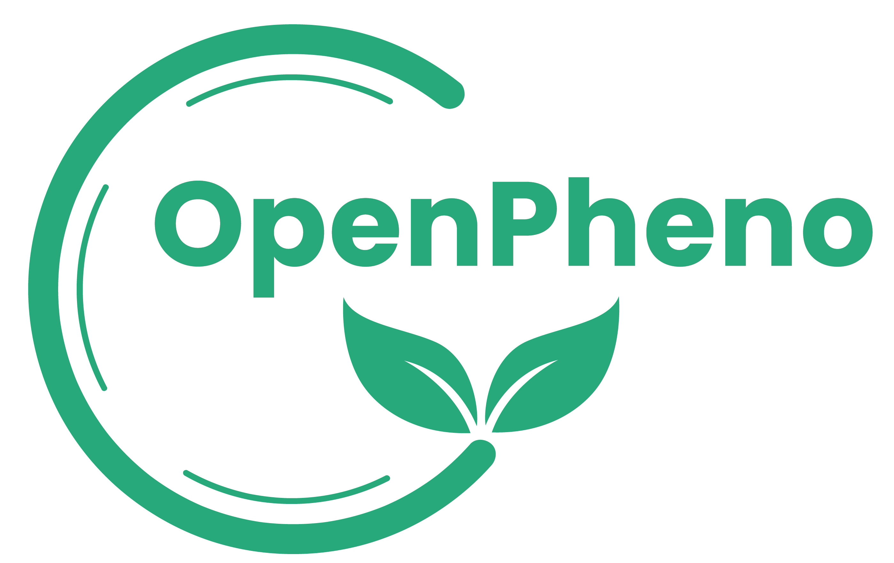
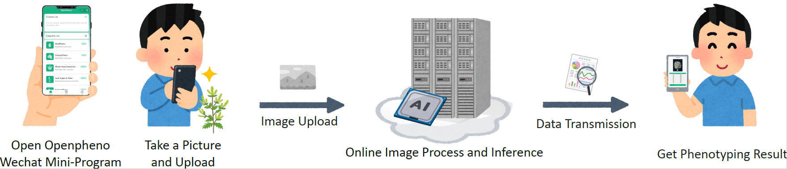
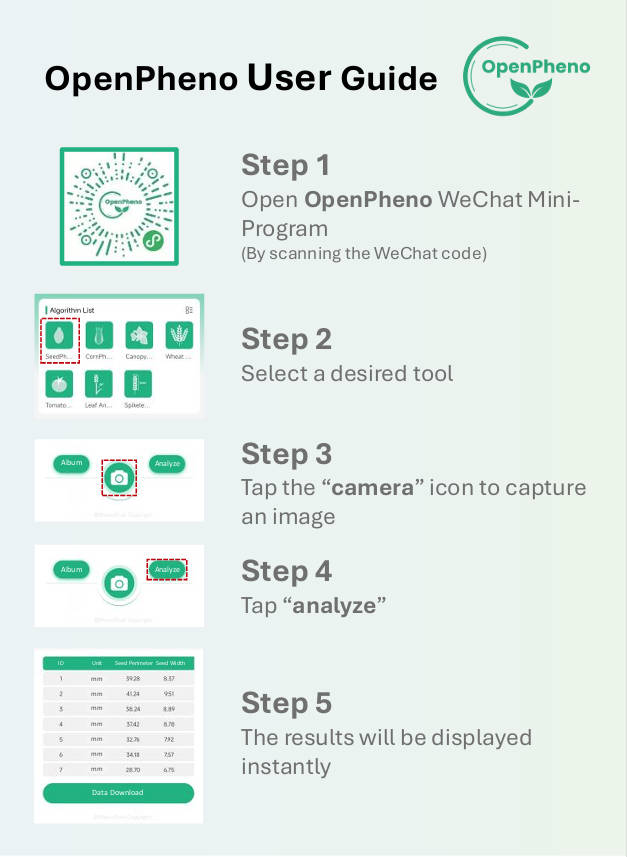

# OpenPheno: Open-Access, User-Friendly, Smartphone-Based Plant Phenotyping Platform

[](https://github.com/OpenPheno/OpenPheno/blob/main/LICENSE)  
[](https://opensource.org/licenses/MIT)


<div style="text-align:center;">
  
</div>

## About OpenPheno

OpenPheno is an open-access, user-friendly, and smartphone-based software platform designed for instant plant phenotyping. It is encapsulated within a WeChat Mini-Program, leveraging cloud computing to provide a portable, intuitive, and cost-free solution for plant scientists, breeders, and enthusiasts. OpenPheno aims to democratize plant phenotyping by making advanced tools accessible to a broader audience, including those without specialized hardware or coding skills.

## Key Features

- **Zero-Cost and Portable**: No specialized hardware required. Accessible via smartphone through the WeChat Mini-Program.
- **Diverse and Open**: Supports phenotyping of various plant species. Developers can contribute new algorithms to expand the platform's capabilities.
- **Real-Time Analysis**: Capture plant images with your smartphone and get phenotyping results instantly.
- **User-Friendly Interface**: Designed for users with different backgrounds, from researchers to field technicians.

## Applications

OpenPheno currently supports the following phenotyping tools:

1. **SeedPheno**: Automated seed size and count analysis.
2. **WheatHeadPheno**: Wheat head detection and morphological analysis.
3. **LeafAnglePheno**: Measurement of flag leaf angle in wheat.
4. **SpikeletPheno**: Spikelet counting and morphological analysis in wheat.
5. **CanopyPheno**: Analysis of plant canopy structure.
6. **TomatoPheno**: Measurement of tomato fruit size and count.
7. **CornPheno**: Corn kernel counting and row feature extraction.

<div style="text-align:center;">
  
</div>

## Getting Started

### Prerequisites

- **Smartphone**: iOS or Android device with WeChat installed.
- **Internet Connection**: Required for data transmission and cloud processing.

### Usage
1. Open the OpenPheno WeChat Mini-Program on your smartphone.
2. Select a phenotyping tool (e.g., SeedPheno, WheatHeadPheno).
3. Capture an image of the plant specimen.
4. Tap "Analyze" to process the image and view the results.

<div style="text-align:center;">
  
</div>

## Contributing
We welcome contributions from the community to enhance OpenPheno's capabilities. To contribute a new algorithm or tool:

- **Develop Your Tool**:
Implement your algorithm in Python.
Ensure it follows the OpenPheno API format. The submitted content must include the following files and directories, organized as shown below:
  ```
  <root_directory>/
  ├── main.py
  ├── weights/
  ├── test_samples/
  ├── output/
  ├── requirements.txt
  └── README.md
  ```
  
    1. `main.py` File:
        The `main.py` file serves as the unified entry point for the algorithm and must include the following function definition:
        - `main_algorithm(image)`: Accepts an image input and returns the algorithm's processing result.
    
    2. Output Files:
        All inference output files can be saved in the `output/` directory.
    
    3. Weight Files:
        - All weight files must be stored in the `weights/` directory.
        - Weight files should be dynamically loaded in `main.py`, with paths relative to `weights/`.
        - It is recommended to remove redundant weights before submission, retaining only the necessary ones.
      
    4. `requirements.txt` File:
        - List all required dependency libraries and their versions, for example:
          ```
          numpy==1.21.0
          opencv-python==4.5.3
          onnxruntime==1.10.0
          ```
        - The platform will automatically install dependencies in a virtual environment based on this file to test the code's runtime environment.
      
    5. Test Samples:
        - Provide 2-5 test sample images, stored in the `test_samples/` directory.
        - Test file types must cover the main formats supported by the algorithm (e.g., `.jpg`, `.png`).
    
    6. `README.md` File:
        Must include the following content:
        - **Algorithm Overview**: Briefly describe the algorithm's functionality and principles.
        - **Author and Affiliation**: Provide the author information, including name and affiliation.
        - **Usage Instructions**: Explain the logic, input, and output of `main_algorithm`.
        - **Environment Requirements**: Specify the required Python version and hardware needs.


- **Submit Your Contribution**:
Create a pull request with your executable files, model weights, requirments, test samples, and documentation.
Developers should package the files prepared according to the above guidelines into a `.zip` or `.tar.gz` format and e-mail them to openpheno@phenotrait.com. 


- **Platform Checks**:
The platform will perform the following checks:
  - File Structure Check: Verify the presence of required files and directories.
  - Code Check: Confirm that the `main_algorithm` method is defined.
  - Weight Validation: Ensure necessary weight files are provided.
  - Dependency Check: Verify completeness of dependency files and check for version conflicts.
  - Output Validation: Confirm that the algorithm outputs files according to the guidelines.
  - Performance Test: Test algorithm execution using the provided `test_samples/`.


- **Release and Version Management**：
  - Algorithms that pass the review will be published to the community and assigned a version number.
  - Developers can update the algorithm by submitting new version packages.
    

## Contact
For any questions or support, please contact the OpenPheno team at openpheno@phenotrait.com.
